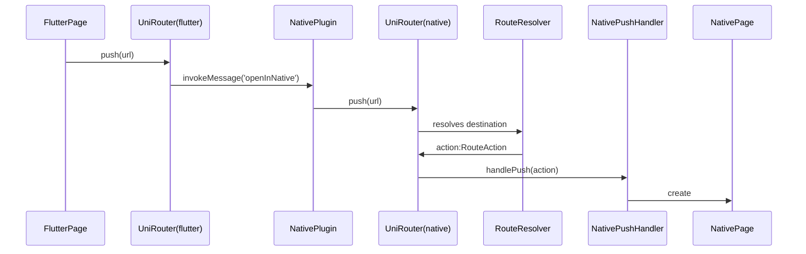
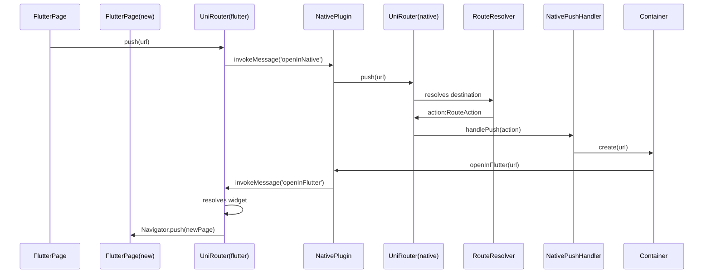
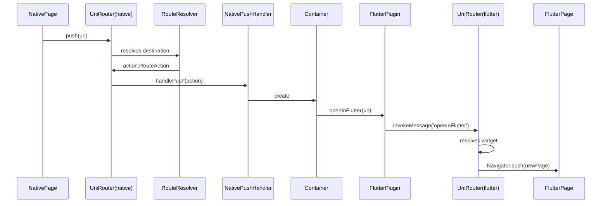
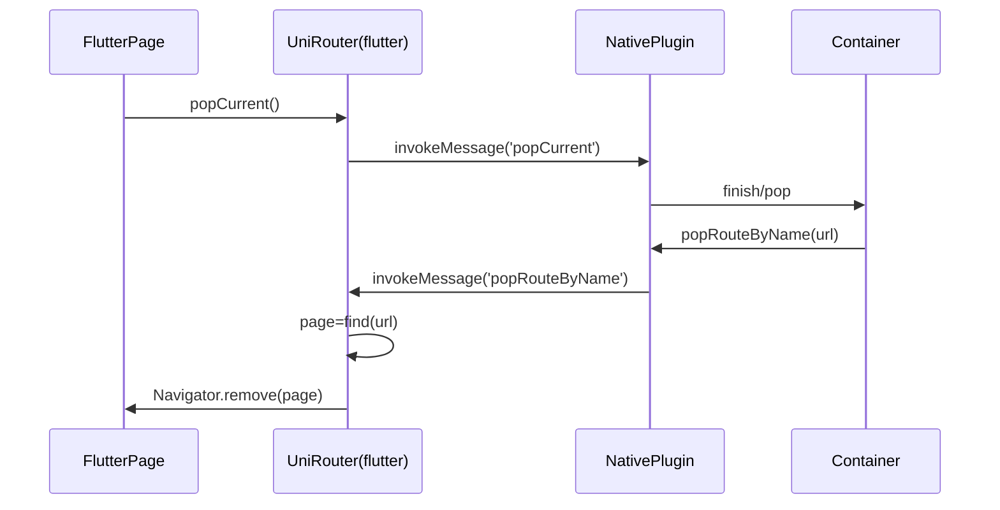

# UniRouter

移动客户端应用统一导航路由插件。支持 Android/iOS Native 与 Flutter 之间的混合跳转

## 简介
Android/iOS与Flutter之间由于有不同的UI栈管理机制，但当前移动客户端无法做到只用Flutter进行开发，需要同时兼容Native与Flutter的混合调用和导航跳转。另外即便只使用Native或只使用Flutter，一般的Hardcode直接跳转方式不利于界面间的解耦，无法灵活做到运行时变更跳转目标，因而遇到一些Bug时想通过降级手段切换展现的界面变得十分困难。UniRouter 可以以URL作为统一的界面目标描述，同时向UI界面屏蔽导航跳转的实现细节，通过与配置管理结合可以轻易实现运行时重定向跳转界面和降级等功能。UniRouter通过Flutter插件机制实现了Native与Flutter之间的混合UI栈管理以及混合跳转等能力，使用者不必依赖具体的实现细节。

## 主要原理
由于Flutter以原生的View作为容器，Flutter中所有的界面属于在该容器中自绘和管理，虽然当前Flutter已经支持嵌入Native View，但其实只是将Native View中的渲染画面映射到Flutter中，处理代价较高，不能大量使用，而且当前还处于预览版阶段，对系统的最低要求较高（Android要API 20以上）。所以要实现Native与Flutter的混合跳转，比较可行的就是每一次跳转到新的Flutter界面都使用新的Native容器（Activity、UIViewController）实例，弹出时Native容器实例和这个Flutter界面一同弹出，这样实际上建立了Native容器与Flutter界面的一一对应关系。
其中最简单的形式是每一个Native容器创建一个Flutter View（注意这里的Flutter View其实是Flutter在Native侧的真正View容器）与之对应，跳转的时候就和Native层的跳转管理一致，即无需管理Flutter的UI栈（因为不存在Flutter栈）。但问题是当前Flutter View和Flutter Engine存在一对一的关系，即创建新的Flutter View意味着创建一个新的Engine，内存、线程等开销非常大。虽然iOS已经可以通过自行创建和管理FlutterEngine，然后Flutter View复用，但Android仍然无法实现（近期官方正在对此进行重构），即便能复用FlutterEngine，创建Flutter View依然存在一定的消耗，因此Flutter View也需要进行复用。
为了更好地兼容Android和iOS，并统一跳转管理机制，所以UniRouter采用**单例Flutter View**的方式进行复用。在Flutter View单例中会存在Flutter的UI栈，打开新的Flutter界面时会进行入栈。但要兼容与Native之间的跳转，依然需要保证Native容器与Flutter界面的一致性。在跳转到新的Flutter界面时，需要首先通过Method Channel的方式请求Native层先创建容器，然后在容器创建后再通过Method Channel反向请求Flutter层将Flutter界面压入Flutter的UI栈，当要弹出时，同样请求Native层进行操作，在Native层pop出容器后再反向让Flutter层pop，这样就可以Native容器和Flutter的UI栈关系一一对应。注意这里对应这只限于Native容器与Flutter之间，因为Native自己本身也可以存在其他非容器的Native界面。
入栈和出栈过程中的过渡动画统一由Native容器本身的过渡动画实现，统一用户体验。入栈时Flutter View单例从原Native容器移除，原Native容器在其移除前保留截图并显示在Native容器中以保证过渡动画时可见。

**1. Flutter跳转到Native的主要流程如下：**


**2. Flutter跳转到另一个Flutter界面的主要流程如下：**

**3. Native跳转到Flutter界面的主要流程如下：**


**4. Flutter出栈的主要流程如下：**


由于**Flutter的处理和Native的处理不在同一线程**，因此以上调用实际上涉及到线程的切换，是异步执行的。另外为保险起见，在Native容器被覆盖后再次切换为可见的交互状态（onResume、viewDidAppear）时，强制Flutter栈栈顶为当前容器对应的Flutter界面（上层如果存在其他界面的话，直接从Flutter栈pop出），当Native容器全弹出后，强制清空Flutter栈（栈底的根界面保留）。另外**必须保证每一个界面实例（包括Native和Flutter）的唯一性**，每一个界面实例使用url和instanceKey共同确定其唯一性。

因为只有单例的Flutter View，且总是位于栈顶中显示，但界面跳转时会出现过场动画，因此需要通过保留最后截图的手段确保在过场动画中即将被遮盖的界面能够正确显示。

## 配置管理
UniRouter 使用两级解析机制向应用提供运行时配置导航路由的能力。首先第一级resovle负责解析出给定url和参数的重定向后的url和参数，然后第二级resolve负责将最终的url和参数映射为具体需要跳转的目标View并负责跳转。一般来说应用程序的配置基本上集中在第一级resolve，因为这部分可以很容易地和配置管理结合进行动态映射。应用程序需要自行维护配置的更新以及将这些全局的配置在Native与Flutter端保持同步。通过UniRouter的配置管理扩展机制应用程序可以实现如降级处理这类能力。

## 使用方法
### Flutter端
将UniRouter.instance.observer添加到顶级app构造参数中，且顶级app需要指定一个全局的key(如下面的gHomeItemPageWidgetKey)
```dart
  @override
  Widget build(BuildContext context) {
    ThemeData themeData = new ThemeData(
      primarySwatch: Colors.blue,
    );
    return new MaterialApp(
      title: 'Unirouter Demo',
      theme: themeData,
      home: new MyHomeWidget(key: gHomeItemPageWidgetKey),
      navigatorObservers: [UniRouter.instance.observer],
    );
  }
```

将顶级应用的全局key设置到UniRouter的globalKeyForRouter属性中
```dart
    UniRouter.instance.globalKeyForRouter = gHomeItemPageWidgetKey;
```

配置Flutter侧的url跳转解析逻辑（以下只是Hardcode的简单例子，建议实际使用时使用配置文件和动态更新等方式）
```dart
    UniRouter.instance
      ..setRouteWidgetHandler(({RouteAction routeAction, Key key}) {
        // We just push to the same page no matter what url is.
        return FlutterDemoWidget(routeAction, key: key);
      });
```

在runApp后对UniRouter进行初始化
```dart
  runApp(new UniRouteDemoApp());
  await UniRouter.instance.init();
```
导航跳转调用UniRouter的push方法实现
```dart
    UniRouter.instance.push(url, instanceKey: instanceKey);
```
弹出当前栈调用UniRouter的pop方法实现
```dart
    UniRouter.instance.pop();
```

### Android端
初始化，设置Application Context
```java
    UniRouter.instance().init(appContext);
```
配置应用的两级路由解析逻辑（以下只是Hardcode的简单例子，建议实际使用时使用配置文件和动态更新等方式）
```java
    UniRouter.instance().setRouteResolver((url, instanceKey, params) -> {
      if(url != null) {
        if(url.startsWith("/flutterdemo")) {
          return new RouteAction(url, instanceKey, params, true);
        }
        else if(url.startsWith("/nativedemo")) {
          return new RouteAction(url, instanceKey, params, false);
        }
      }
      return null;
    });
    UniRouter.instance().setNativePushHandler((context, action) ->{
      Intent intent;
      if(action.flutterSide) {
        intent = new Intent(context, FlutterWrapperActivity.class);
        intent.setAction(FlutterWrapperActivity.ACTION_PUSH);
      }
      else if(action.url.startsWith("/nativedemo")){
        intent = new Intent(context, UniDemoActivity.class);
        intent.setAction(Intent.ACTION_VIEW);
      } else {
        return false;
      }
      intent.setData(Uri.parse(action.url));
      intent.putExtra("instanceKey", action.instanceKey);
      intent.putExtra("params", action.params);
      if(!(context instanceof Activity)) {
        intent.addFlags(Intent.FLAG_ACTIVITY_NEW_TASK);
      }
      context.startActivity(intent);
      return true;
    });
```
导航跳转调用UniRouter的push方法实现
```java
    UniRouter.instance().push(activityContext, url, instanceKey, params);
```

### iOS端
1.构造UINavigationController实例作为rootWindow的rootViewController并配置应用的两级路由解析逻辑（以下只是Hardcode的简单例子，建议实际使用时使用配置文件和动态更新等方式）
```objc
- (BOOL)application:(UIApplication *)application
    didFinishLaunchingWithOptions:(NSDictionary *)launchOptions {
    // Override point for customization after application launch.
    UINavigationController *rootNav = [[UINavigationController alloc] initWithRootViewController:[UniRootController new]];
    rootNav.interactivePopGestureRecognizer.delegate = self;
    UIWindow *window = [[UIWindow alloc] initWithFrame:[[UIScreen mainScreen] bounds]];
    window.rootViewController = rootNav;
    [window makeKeyAndVisible];
    self.window = window;
    [self setupNativeOpenUrlHandler];
    return YES;
}

- (void)setupNativeOpenUrlHandler{
    static RouteResolver routeResolver = ^RouteAction *(NSString *url, NSString *instanceKey, NSDictionary *params) {
        RouteAction * routeAction = [RouteAction new];
        routeAction.url = url;
        routeAction.instanceKey = instanceKey;
        routeAction.params = params;
        routeAction.flutterSide = YES;
        if([url hasPrefix:@"/nativedemo"]){
            routeAction.flutterSide = NO;
            
        }
        return routeAction;
    };
    [UniRouter sharedInstance].routeResolver = routeResolver;
    static NativePushHandler nativePushHandler = ^BOOL (RouteAction *action) {
        if(action.flutterSide) {
            [[UniFlutterAgent sharedInstance] openInFlutter:action.url instanceKey:action.instanceKey params:action.params];
            return YES;
        }
        else {
            UIViewController *vc = [UniDemoController new];
            if(vc!=nil) {
                UINavigationController *rootNav = (UINavigationController*)[UIApplication sharedApplication].delegate.window.rootViewController;
                [rootNav pushViewController:vc animated:YES];
                return YES;
            }
        }
        return NO;
    };
    [UniRouter sharedInstance].nativePushHandler = nativePushHandler;
}
```
导航跳转调用UniRouter的push方法实现
```objc
    [[UniRouter sharedInstance] push:url instanceKey:instanceKey params:@{}];
```

## 其他
Android侧的FlutterWrapperActivity（通过setCustomPluginRegistrant静态方法）和iOS侧的UniFlutterAgent（通过customPluginRegistrant属性）都分别提供了自定义Flutter插件注册的机制，如果使用以上类作为Flutter容器，可以通过此注册机制注册其他自定义插件而非仅依赖Flutter自动生成的插件注册类。

## 主要限制
- push仅支持顶级界面的跳转
- 需要应用自行解决获取界面返回值
- 跳转流程存在多线程的切换处理
- 在弹出的过场动画中可能看到截屏中最后的按钮点击等状态效果（iOS支持拖动返回的时候尤为明显）

## TODO
待后续Android端FlutterView和FlutterEngine分离重构后，可以考虑FlutterEngine单例给多个FlutterView复用，然后FlutterView通过对象池保证数量和内存开销可控的同时获得更好的兼容性和降低复杂度。